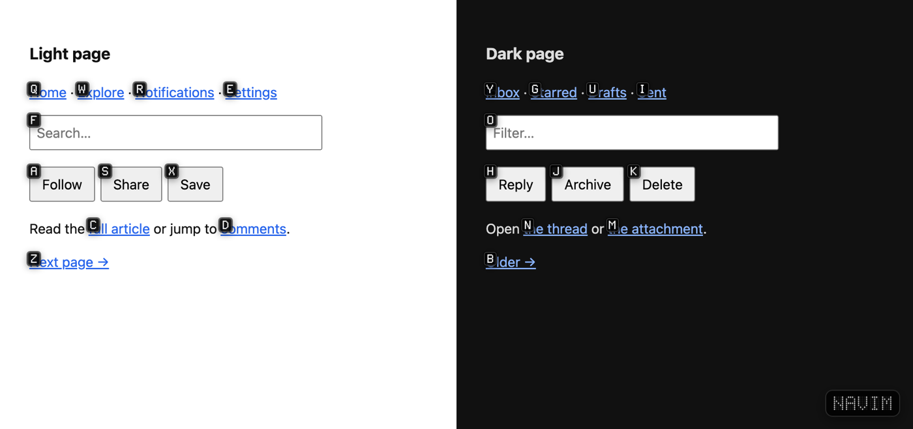
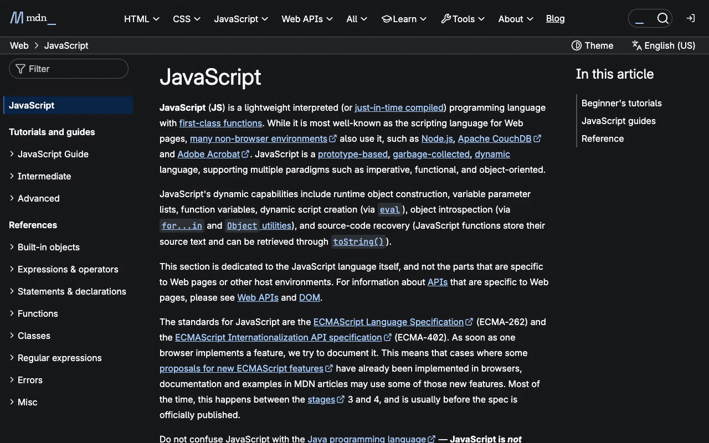

<p align="center">
  
</p>

<h1 align="center">NaVIM</h1>

<p align="center">
  Fly the web from <b>one key</b>: your <b>right Option</b>.<br>
  Tap it and every link gets the key that sits where it sits. Hold it to throttle through the page.
</p>

---

NaVIM is a browser extension for the keyboard. It was built for **Search**, a
WebKit browser for macOS, and it's plain JavaScript with no build step, so it
also loads unpacked in Chrome, Helium, Arc and other Chromium browsers.

It's built on three ideas:

1. **One key does everything.** Every command goes through the right Option
   key. Plain typing is never intercepted on any site, left Option still
   types `å ∂ ∆`, and there are no modes to keep track of.
2. **The keyboard is a map of the screen.** A link's label is the key that
   sits where the link sits: top-left links get `Q W E`, bottom-right
   ones get `M , . /`. Your hand knows the first key before you read the label.
3. **Movement feels like flying.** Holding `j` opens a throttle that keeps
   speeding up. `]` and `[` jump between the page's headings like waypoints.

## The keyboard is a map

```
 ┌──────────────────── your screen ────────────────────┐
 │  Q    W    E    R    T    Y    U    I    O    P     │  top
 │    A    S    D    F    G    H    J    K    L    ;   │  middle
 │       Z    X    C    V    B    N    M    ,    .   / │  bottom
 └─────────────────────────────────────────────────────┘
```

Tap right ⌥, and NaVIM lays your keyboard over the page, using the real
stagger of the three letter rows:

- **Sparse page:** every target gets the free key closest to where it sits,
  so each label is one key and points at its own corner of the screen.
- **Busy page:** the first key picks the patch of screen under that key, and
  that patch becomes a keyboard of its own. The second key picks the link
  within the patch, by the same rule.

On Hacker News, with 161 targets, every label is two keys at most. A link
near the top-left starts with `W`, one halfway down the left side starts with
`A`, and one at the bottom starts with `Z`. You don't search the page for
your label, because you already know where it starts.



Start typing a label, and the letters you've typed dim while labels that no
longer match disappear. Here's Hacker News after pressing `A`: only the patch
under `A`, the middle-left of the screen, is left:


## Demo

Real sites, real keypresses. The caption in the bottom-left shows what's
being pressed.

**Hacker News:** tap ⌥, type a label to open the comments, hold ⌥ + `j` and
feel the throttle speed up, then ⌥ + `h` to go back.


**Wikipedia:** ⌥ + `]` flies heading to heading, framing each one, and
⌥ + `[` goes back. Then a label takes you to *Bram Moolenaar*.


**GitHub:** label → Issues tab, ⌥ + `d` half-page scrolls, ⌥ + `g` back to
the top. GitHub's web components get labels too.


**YouTube:** ⌥ + `i` lands in the search box, then you just type. Tap ⌥ for
labels on the results, `Esc` to cancel.


**MDN:** throttle, half-page, top, then tap ⌥ twice to show and dismiss the
labels.



### Labels on popular sites

| | |
|---|---|
|  |  |
| **Wikipedia** | **Hacker News** |
|  |  |
| **GitHub** | **YouTube** |
|  |  |
| **Reddit** | **MDN** |
|  |  |
| **BBC News** | **Amazon** |

<sub>How these were made: [`tools/showcase`](tools/showcase/showcase.mjs)
loads each site in a headless Chromium browser (Helium), injects NaVIM's
content scripts unchanged, and presses real keys: right-⌥ taps and holds
reach `src/keys.js` just as a person's keypresses would. The sites are live
and logged out, so you'll see cookie banners and sign-in prompts.</sub>

## Keys

### Tap right ⌥: lock on

| Key | Does |
|---|---|
| tap **right ⌥** | label every visible link, button and field |
| type a label | click it, or focus it if it's a text field |
| **Shift** + the label's last key | open the link in a new background tab |
| `Backspace` | undo the last key |
| `Esc`, or tap right ⌥ again | cancel |

A tap means pressing and releasing right ⌥ within 350 ms with no other key in
between. Scrolling, resizing or pressing a ⌘ shortcut also closes the labels.

### Hold right ⌥ + key: fly

| Key | Does |
|---|---|
| `j` / `k` | **throttle** down / up: starts at reading pace and speeds up the longer you hold, then stops the moment you let go |
| `]` / `[` | **waypoints**: jump to the next / previous heading and frame it |
| `d` / `u` | half a page down / up |
| `g` / `G` | top / bottom |
| `h` / `l` | back / forward |
| `r` | reload |
| `i` | land in the first text box on the page |
| `f` / `F` | lock on / lock on, opening links in new tabs |
| `y` | copy the page URL (a `COPIED` badge confirms) |

The letters come from vim: `hjkl` move, `g`/`G` go to the ends, `d`/`u` move
half a page, `y` yanks (copies), `]`/`[` jump between sections.

## Install

### Search

1. Clone the repo: `git clone https://github.com/Christianships/NaVIM`
2. **Settings → Extensions → Load an unpacked extension**, and pick the
   `NaVIM` folder (the one with `manifest.json`)
3. Turn it on and let it access websites

Search **copies** the folder when it loads an extension. After pulling
changes, use NaVIM's **Reload from its folder** so Search picks them up.

### Chrome, Helium, Arc, Brave

`chrome://extensions` → turn on **Developer mode** → **Load unpacked** → pick
the folder.

## How it works

```
manifest.json        MV3; content scripts on every page and frame, at document_start
src/keys.js          tracks the right ⌥ (tap vs hold), routes keys
src/keymap.js        the keyboard-as-map labelling
src/hints.js         finds what can be clicked, draws labels, handles typing
src/commands.js      the hold-⌥ commands: throttle, waypoints, scrolling, history
src/overlay.js       one click-through layer in a closed shadow root, the HUD badge
src/font.js          GohuFont 14, cut down and built in as base64
src/dotmatrix.js     5×7 round-dot glyphs for the HUD badge
src/background.js    opens new tabs
```

**Spotting the right Option key.** Browsers don't say which Option key is held
while you press `j`, only that *an* Option key is. But pressing the Option key
by itself fires its own event with `code: "AltRight"`. NaVIM watches that key
go down and up, and only reacts to other keys while it's held. It reads the
physical key (`KeyJ`) instead of the typed character, because ⌥J types `∆`.
It blocks those keys before the page sees them, so no stray `∆` or accent
gets typed.

**Labelling** (`src/keymap.js`). Each target's centre becomes a point in
"key units": 10 across and 3 down, with rows shifted right by 0 / ¼ / ¾ like a
real keyboard. If there are 30 or fewer targets, each takes the nearest free
key, closest pairs first. With more, they're grouped by the key they sit
under, and each group is labelled again inside that key's patch of screen.
If a whole group sits under one key, as in a long dense list, it falls back
to reading order. Labels are prefix-free by construction: a key either
finishes a label or opens a patch, never both.

**What gets a label.** Links, buttons, inputs, ARIA roles (`button`, `link`,
`tab`, `menuitem`…), `onclick`/`jsaction` handlers and focusable elements,
including those inside open shadow roots. An element only gets a label if
it's on screen and actually showing at that spot (checked with
`elementFromPoint`), so things hidden behind modals and sticky headers are
skipped. Nested matches covering the same area share one label.

**Clicking.** NaVIM fires the full pointer/mouse sequence at the element's
centre, so JavaScript-heavy sites react the same way they would to a real
click.

**Throttle.** Holding `j` starts a `requestAnimationFrame` loop. Speed starts
at 650 px/s, climbs 2,400 px/s for every second held, and tops out at
2,800 px/s. Releasing `j`, `k` or right ⌥, or switching away from the
window, cuts it.

**Waypoints.** `h1`–`h6` and `[role=heading]` elements, in page order. The
heading you just landed on is skipped, so pressing `]` repeatedly keeps
moving forward.

**What scrolls.** It scrolls the box you last clicked in. Otherwise it
scrolls the page, and if the page itself doesn't scroll, the largest
scrollable box on it, which is how sites like Gmail and Discord are built.

**Safe on any page.** The overlay lives in a closed shadow root built
without `innerHTML`, so it works on sites that enforce Trusted Types
(YouTube, Google). Page CSS can't restyle it, and page scripts can't find it.
The font is built in, so a site's font restrictions can't block it either.

## Design

- **Labels:** white [GohuFont 14](https://font.gohu.org/) on black, 15 px
  tall, letters you've typed dimmed to gray. GohuFont is a bitmap font, so
  at its native 14 px every pixel lands on the grid and stays crisp.
- **Waypoint frame:** a white outline around the heading you landed on,
  which fades out after about a second.
- **HUD badge:** a dot-matrix `NAVIM` in the bottom-right while labels are
  up, also used for `COPIED`, `LAST`, `NO INPUT` and similar messages.
- **Icon:** a chrome serif V on a beveled black diamond with a dot-matrix
  face. Generated by `tools/make-icon.py`.

## Troubleshooting

| Problem | Fix |
|---|---|
| Tapping right ⌥ does nothing | Reload the page: content scripts only load into pages opened after the extension. Browser pages (settings, new tab) never run extensions. |
| Right ⌥ + a key types `∆` or accents | The browser isn't letting NaVIM block the key. Fallback: remap right ⌥ to F18 with Hammerspoon or Karabiner, only while Search is in front (`com.officecommun.search`). |
| Labels miss something inside an embedded frame | Labels only cover the frame that has focus. Click into the frame first. |
| Changes don't show up in Search | Search runs a copy. Use **Reload from its folder**. |

## Development

```sh
open preview/labels.html            # label design, idle state
cd tools/showcase && bun install
bun showcase.mjs stills             # label screenshots of popular sites -> docs/showcase/
bun showcase.mjs demo               # scripted recordings -> tools/showcase/out/*.webm
tools/make-font.sh                  # rebuild src/font.js from the installed GohuFont
python3 tools/make-icon.py          # rebuild icons/navim.svg
```

To re-export the PNG icons, render `icons/navim.svg` at 512 px and scale it
down to 16/32/48/128.

## Roadmap

- [ ] Tab commands: next/previous, close, new
- [ ] `?` cheat-sheet overlay
- [ ] Find on page
- [ ] Labels across embedded frames
- [ ] Waypoints for landmarks too (`nav`, `main`, `article`), not just headings
- [ ] Settings: per-site disable, custom key mappings

## Credits

- [GohuFont](https://font.gohu.org/) by Hugo Chargois (WTFPL), here via the
  [Nerd Fonts](https://www.nerdfonts.com/) build
- The command letters come from vim
