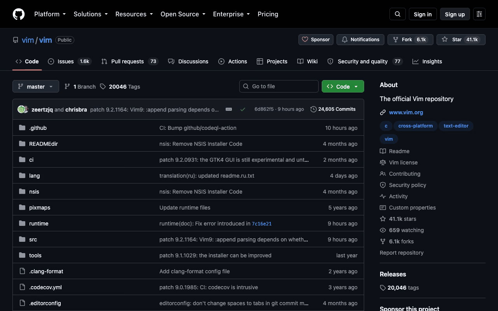
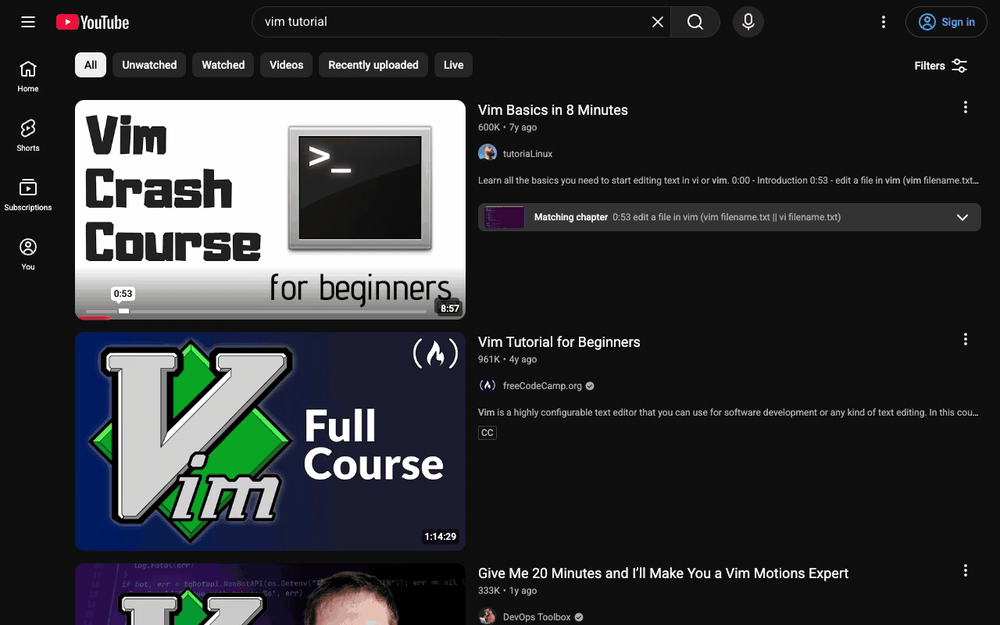
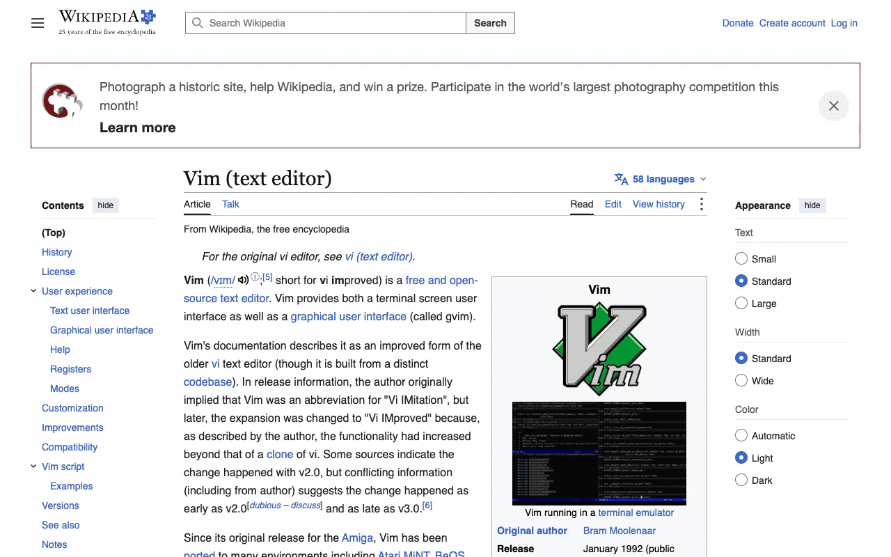
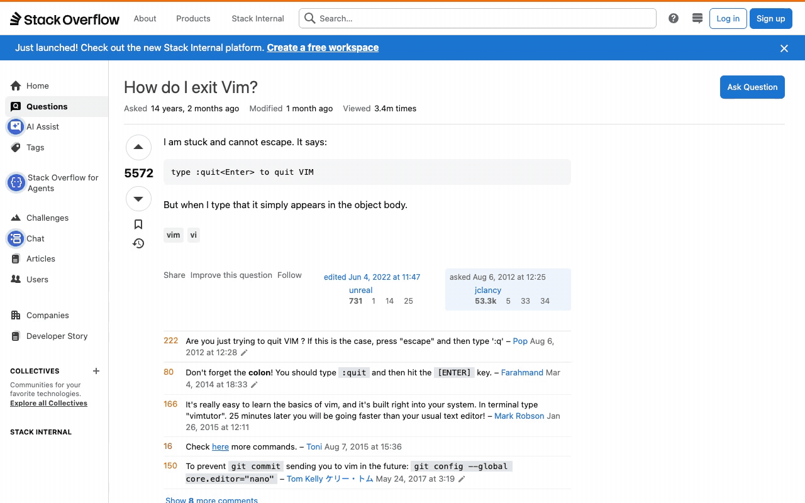
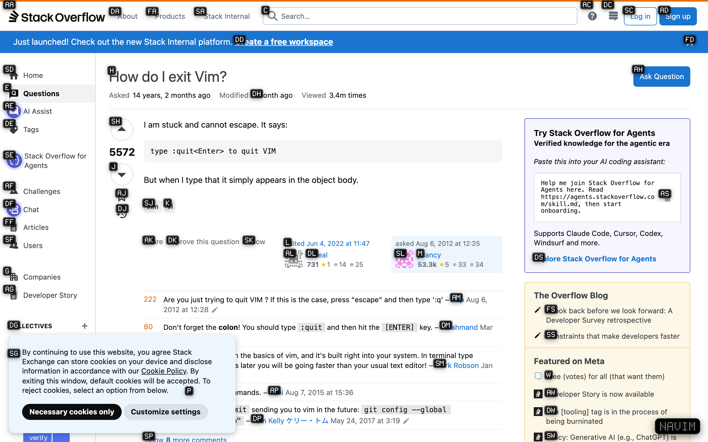
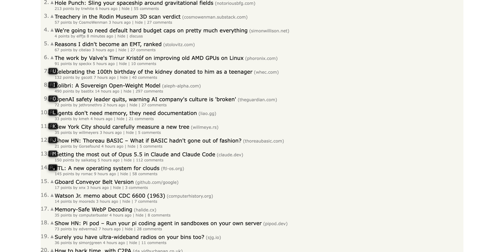

<p align="center">
  
</p>

<h1 align="center">NaVIM</h1>

<p align="center">
  Vim-style browsing on <b>one key</b>: your <b>right Option</b>.<br>
  Tap it to label every link on the page. Hold it to scroll, go back, switch tabs.
</p>

---

NaVIM is a Vimium-style WebExtension built for **Search**, a WebKit browser for
macOS. It's plain JavaScript with no build step, so it also loads unpacked in
Chrome, Helium, Arc and other Chromium browsers.

Most vim-for-the-web extensions are **modal**: single letters are commands
until you click into a text box, and you're always one stray keypress away
from closing a tab. NaVIM uses no modes. Every command runs through the
**right Option key**, so:

- typing is never intercepted, on any site, in any field
- left Option still types `å ∂ ∆` as usual
- you never have to think about insert mode

## Demo

NaVIM on sites you use every day. The caption in the bottom-left corner
shows which keys are being pressed.

**Hacker News:** tap right ⌥, type a label to open the comments, hold ⌥ + `j`
to read, ⌥ + `h` to go back.


**GitHub:** label → Issues tab, ⌥ + `d` half-page scrolls, ⌥ + `g` back to
the top. GitHub's web components get labels too.



**YouTube:** ⌥ + `i` jumps into the search box, then you just type, with no
insert mode. Tap ⌥ for labels on the results, `Esc` to cancel.



**Wikipedia:** scroll with ⌥ + `j`, tap ⌥, type the label for *Bram
Moolenaar*.



**Stack Overflow:** ⌥ + `d` to read, ⌥ + `g` to the top, tap ⌥ twice to show
and dismiss labels.



### Lock-on hints on popular sites

| | |
|---|---|
|  |  |
| **Wikipedia** | **Hacker News** |
|  |  |
| **GitHub** | **YouTube** |
|  |  |
| **Reddit** | **MDN** |
|  |  |
| **Stack Overflow** | **Amazon** |

Start typing a label, and the letters you've typed dim while labels that no
longer match disappear:



<sub>How these were made: [`tools/showcase`](tools/showcase/showcase.mjs)
loads each site in a headless Chromium browser (Helium), injects NaVIM's
content scripts unchanged, and presses real keys: right-⌥ taps and holds
reach `src/keys.js` just as a person's keypresses would. The sites are live
and logged out, so you'll see cookie banners and sign-in prompts.</sub>

## Keys

### Tap right ⌥: lock-on hints

| Key | Does |
|---|---|
| tap **right ⌥** | show labels on every visible link, button and field |
| type a label (e.g. `sd`) | click it, or focus it if it's a text field |
| **Shift** + the label's last letter | open the link in a new background tab |
| `Backspace` | undo the last typed letter |
| `Esc`, or tap right ⌥ again | cancel |

A tap means pressing and releasing right ⌥ within 350 ms with no other key.
Scrolling, resizing or pressing a ⌘ shortcut also closes the labels.

### Hold right ⌥ + key: commands

| Key | Does |
|---|---|
| `j` / `k` | scroll down / up (hold to keep going) |
| `d` / `u` | half a page down / up |
| `g` / `G` | jump to the top / bottom |
| `h` / `l` | back / forward |
| `r` | reload |
| `i` | jump into the first text box on the page |
| `f` / `F` | show hints / hints that open in new tabs |
| `y` | copy the page URL (a `COPIED` badge confirms) |

The keys follow vim: `hjkl` move, `gg`/`G` go to the ends, `d`/`u` move half
a page, `y` yanks (copies).

## Install

### Search

1. Clone the repo: `git clone https://github.com/Christianships/NaVIM`
2. **Settings → Extensions → Load an unpacked extension**, and pick the
   `NaVIM` folder (the one with `manifest.json`)
3. Turn it on and let it access websites

Search **copies** the folder when it loads an extension. After pulling
changes, use NaVIM's **Reload from its folder** so Search picks them up.

### Chrome, Helium, Arc, Brave

`chrome://extensions` → turn on **Developer mode** → **Load unpacked** → pick
the folder.

## How it works

```
manifest.json        MV3; content scripts on every page and frame, at document_start
src/keys.js          tracks the right ⌥ (tap vs hold), routes keys
src/hints.js         finds clickable things, makes labels, handles typing
src/commands.js      the hold-⌥ commands, and works out what should scroll
src/overlay.js       one click-through layer in a closed shadow root + the HUD badge
src/font.js          GohuFont 14, cut down and built in as base64
src/dotmatrix.js     5×7 round-dot glyphs for the HUD badge
src/background.js    opens new tabs
```

**Spotting the right Option key.** Browsers don't say which Option key is held
while you press `j`, only that *an* Option key is. But pressing the Option key
by itself fires its own event with `code: "AltRight"`. NaVIM watches that key
go down and up, and only reacts to other keys while it's held. It reads the
physical key (`KeyJ`) instead of the typed character, because ⌥J types `∆`.
It blocks those keys before the page sees them, so no stray `∆` or accent
gets typed.

**Choosing what to label.** Links, buttons, inputs, ARIA roles (`button`,
`link`, `tab`, `menuitem`…), `onclick`/`jsaction` handlers and focusable
elements. It looks inside open shadow roots, so YouTube-style web components
get labels too. An element only gets a label if it's on screen and actually
showing at that spot (checked with `elementFromPoint`), so things hidden
behind modals and sticky headers are skipped. Nested matches covering the
same area, like `<a><div role=button>`, share one label.

**Labels.** Labels use home-row letters (`sadfjklewcmpgh`). No label is the
start of another, so `s` can't be confused with `sa`. With few targets, each
label is a single letter.

**Clicking.** NaVIM fires the full pointer/mouse sequence (`pointerdown`,
`mousedown`, `pointerup`, `mouseup`, `click`) at the element's centre, so
JavaScript-heavy sites react the same way they would to a real click.

**What scrolls.** It scrolls the box you last clicked in. Otherwise it
scrolls the page, and if the page itself doesn't scroll, the largest
scrollable box on it, which is how sites like Gmail and Discord are built.

**Unaffected by page styles.** Labels live in a closed shadow root with
`all: initial`, so page CSS can't restyle them and page scripts can't find
them. The font is built in, so a site's font restrictions can't block it.

## Design

- **Labels:** white [GohuFont 14](https://font.gohu.org/) on black, 15 px
  tall, letters you've typed dimmed to gray. GohuFont is a bitmap font, so
  at its native 14 px every pixel lands on the grid and stays crisp.
- **HUD badge:** a dot-matrix `NAVIM` in the bottom-right while hints are
  up, also used for `COPIED`, `NO INPUT` and similar messages.
- **Icon:** Vim's beveled diamond and serif V, redone in black and chrome
  with a dot-matrix face. Generated by `tools/make-icon.py`.

## Troubleshooting

| Problem | Fix |
|---|---|
| Tapping right ⌥ does nothing | Reload the page: content scripts only load into pages opened after the extension. Browser pages (settings, new tab) never run extensions. |
| Right ⌥ + a key types `∆` or accents | The browser isn't letting NaVIM block the key. Fallback: remap right ⌥ to F18 with Hammerspoon or Karabiner, only while Search is in front (`com.officecommun.search`). |
| Labels miss something inside an embedded frame | Hints only cover the frame that has focus. Click into the frame first. |
| Changes don't show up in Search | Search runs a copy. Use **Reload from its folder**. |

## Development

```sh
open preview/labels.html            # hint design, idle state
open "preview/labels.html?typed=s"  # mid-typing state
cd tools/showcase && bun install
bun showcase.mjs stills             # hint screenshots of popular sites -> docs/showcase/
bun showcase.mjs demo               # scripted recordings -> tools/showcase/out/*.webm
tools/make-font.sh                  # rebuild src/font.js from the installed GohuFont
python3 tools/make-icon.py          # rebuild icons/navim.svg
```

To re-export the PNG icons, render `icons/navim.svg` at 512 px and scale it
down to 16/32/48/128.

## Roadmap

- [ ] Tab commands: next/previous, close, new
- [ ] `?` cheat-sheet overlay
- [ ] Find on page
- [ ] Hints across embedded frames
- [ ] Double-tap right ⌥ for a sticky, Vimium-style mode
- [ ] Settings: per-site disable, custom key mappings, label alphabet

## Credits

- [Vimium](https://github.com/philc/vimium), for the labelling scheme
- [GohuFont](https://font.gohu.org/) by Hugo Chargois (WTFPL), here via the
  [Nerd Fonts](https://www.nerdfonts.com/) build
- Vim's logo, which the icon riffs on
