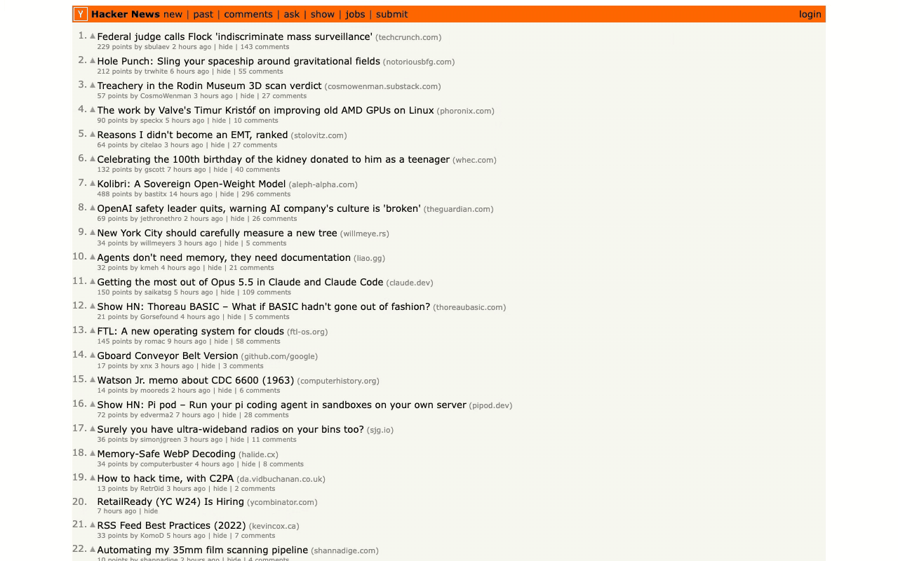
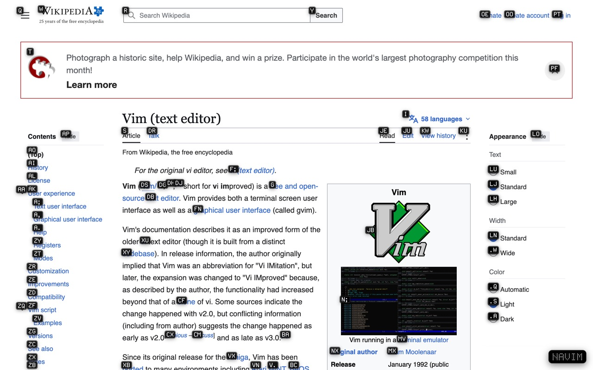
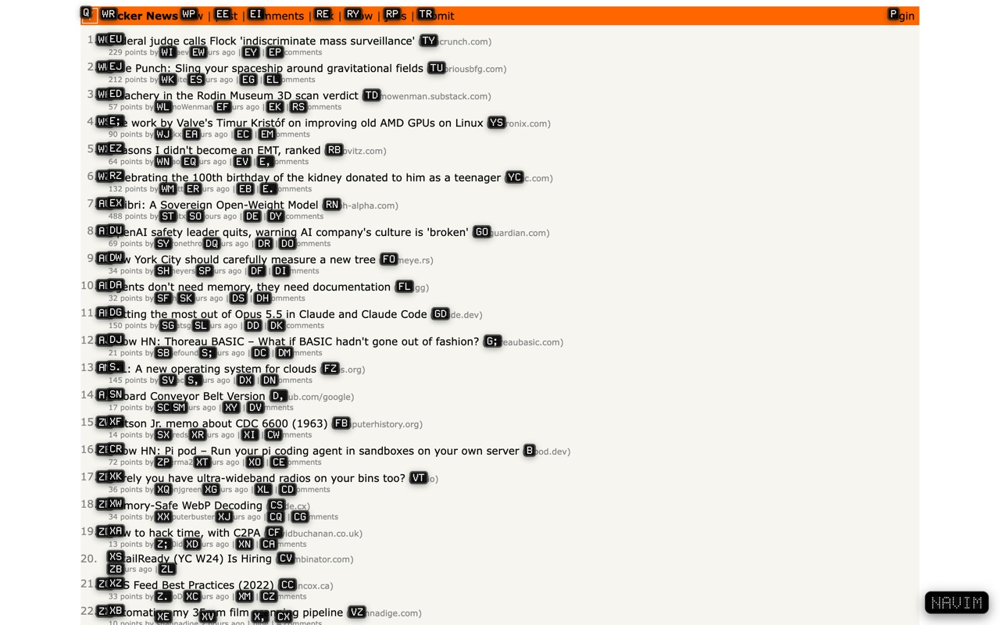
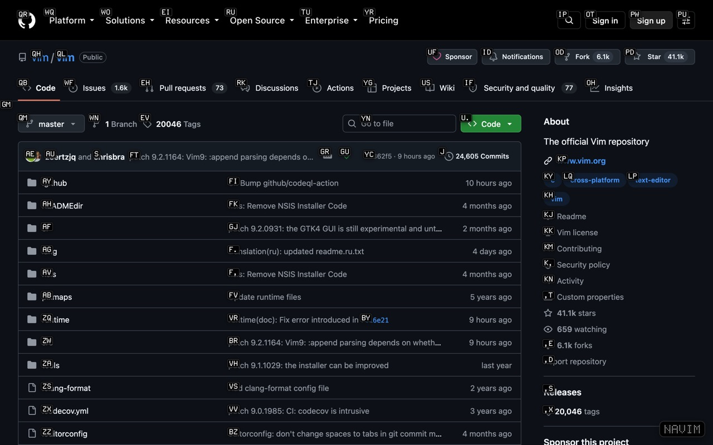
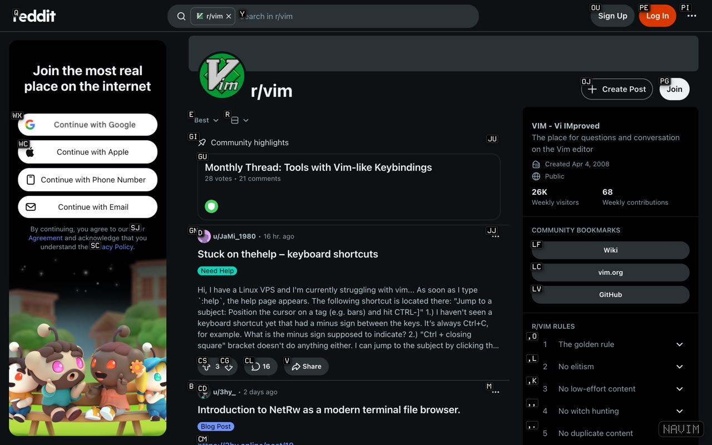
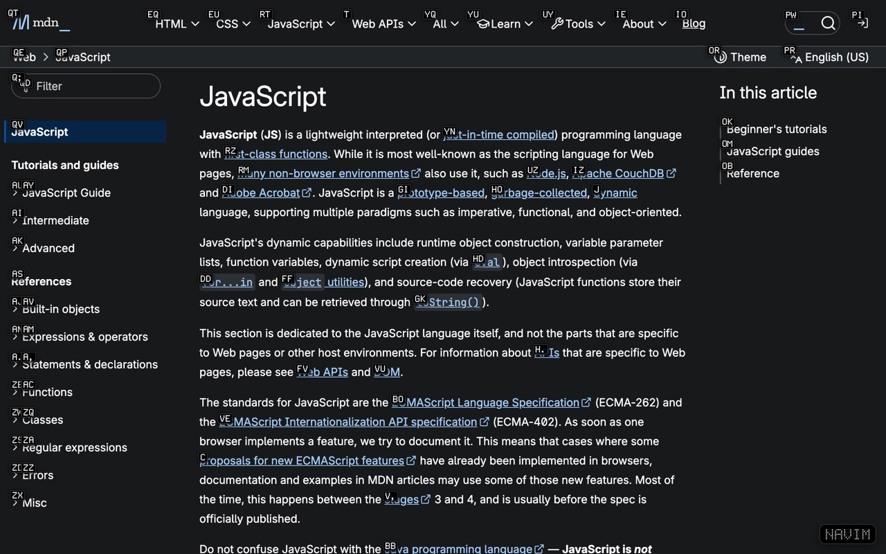
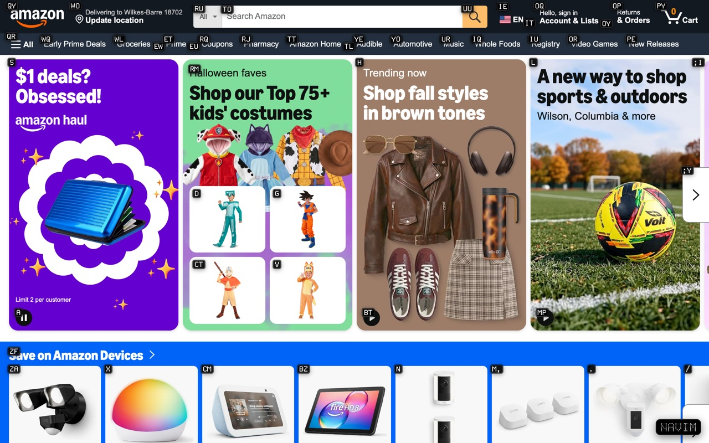

  

  
  

<h1 align="center">NaVIM</h1>

Browse the web using Vim like the unemployed.

| | |
|---|---|
|  |  |
|  |  |
|  |  |
|  |  |

## Keys

**Tap right ⌥** to label every link. Each label is the key that sits where
the link sits on screen (`Q` top-left, `/` bottom-right). Type it to click.
Add **Shift** to open it in a new tab, or press **Esc** to cancel.

**Hold right ⌥** plus:

| Key | Does |
|---|---|
| `j` / `k` | scroll down / up (speeds up the longer you hold) |
| `]` / `[` | next / previous heading |
| `d` / `u` | half page down / up |
| `g` / `G` | top / bottom |
| `h` / `l` | back / forward |
| `r` | reload |
| `i` | jump into the first text box |
| `y` | copy the page URL |

Normal typing is never affected.

## Install

1. Download or clone this repo.
2. Load the `NaVIM` folder (the one with `manifest.json`) as an unpacked
   extension:
   - **Chrome-based browsers** (Chrome, Edge, Brave, Arc, Helium): go to
     `chrome://extensions`, turn on **Developer mode**, click **Load
     unpacked** and pick the folder.
   - **WebKit-based browsers:** open the browser's extension settings, choose
     the option to load or add an extension from a folder, and pick the
     folder.
3. Refresh any tabs that were already open.

---

⭐ If NaVIM saves you from reaching for the mouse, <a href="https://github.com/Christianships/NaVIM">star the repo</a> so more people find it.

